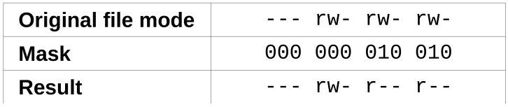
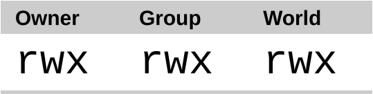
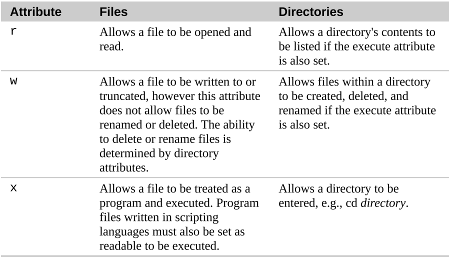
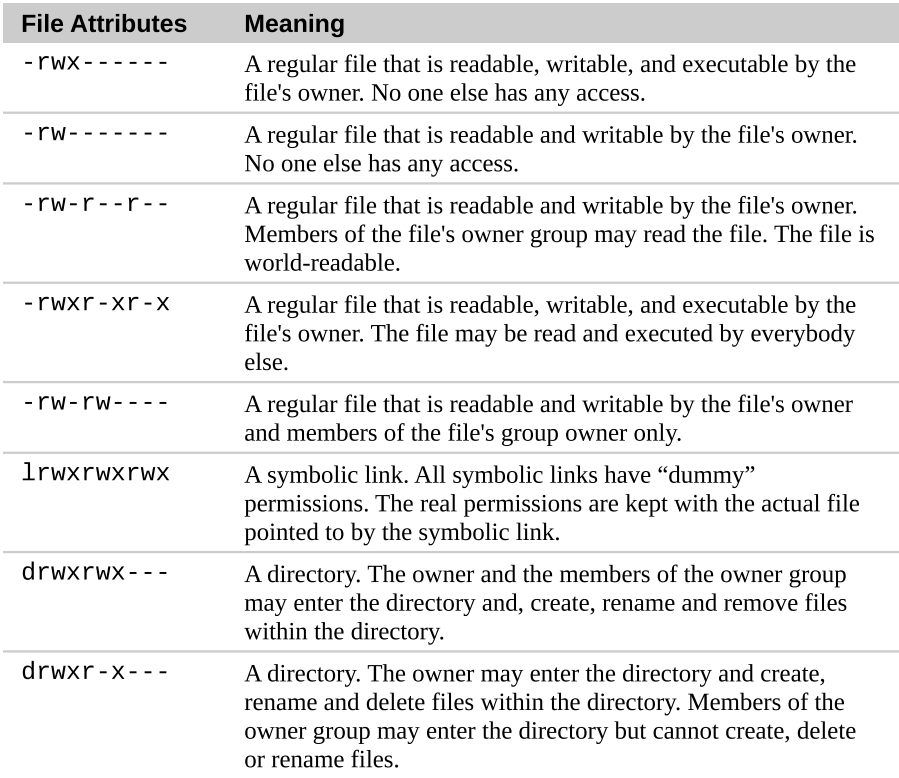
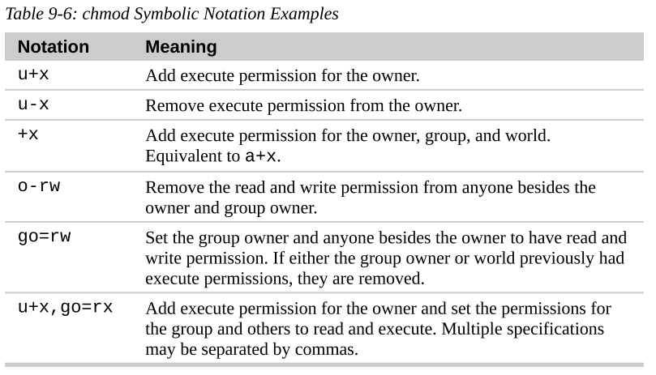
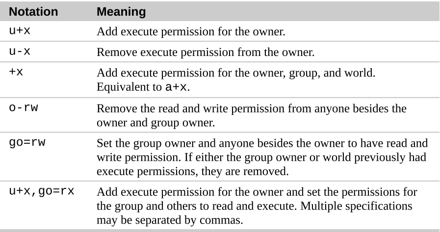

```{r setup, include=FALSE}
knitr::opts_chunk$set(echo = TRUE)
```

# Navigation
1. `pwd`: print name of current working directory.  
2. `cd`: change directory.  
    - `cd`: change the working directory to your home directory.  
    - `cd -`: changes the working directory to the previous working directory.  
    - `cd ~user_name`: change the working directory to the home directory of `user_name`.  
3. `ls`: list directory contents.  
4. `.`: refers to the working directory.  
5. `..`: refers to the working directory's parent directory.  


**Absolute and relative pathnames**  
An absolute pathanme begins with the root directory and follows the tree branch by branch until the path to the desired directory or file is completed.  

A relative pathname starts from the working directory to the destination.  


# Exploring the system
1. `file`: determine file type.  
2. `less`: view file contents.  
    - `ls ~ /usr`
    - `ls -l`
    

**Options and arguments**  
```
command -options arguments
```

# Manipulating Files and Directories
1. `cp`: copy files and directories  
    - `cp item1 item2`: copy single file or directory 'item1' to file or directory 'item2'  
    - `cp item ... directory`: copy multiple items into a directory  
    - `cp file1 file2`: copy file1 to file2, if file2 exists, it is overwritten with the contents of file1. If file2 does not exist, it is created.  
    - `cp -i file1 file2`: same as above, except that if file2 exists, the user is prompted before it is overwritten.  
    - `cp file1 file22 dir1`: copy file1 and file2 into directory dir1. dir1 must already exist.  
    - `cp dir1/* dir2`: Using a wildcard, all the files in dir1 are copied into dir2, dir2 must already exist.  
    - `cp -r file1 file2`: copy the contents of directory dir1 to directory dir2. If directory dir2 does not exist, it is created and, after the copy, will contain the same contents as directory dir1.  

2. `mv`: move/rename files and directories  
    - `mv item1 item2`: move or rename file or directory item1 to item2.  
    - `mv item ... directory`: move one or more items from one directory to another.  
3. `mkdir`: create directories  
4. `rm`: remove files and directories  
5. `ln`: create hard and symbolic links   
    - `ln file link`: create a hard link
    - `ln -s item link`: create a symbolic link, where 'item' is either a file or a directory.  


**Hard and Symbolic Links**  
- Hard links are the original Unix way of creating links, compared to symbolic links, which are more modern. By default, every file has a single hard link that gives the file its name. When we create a hard link, we create an additional directory entry for a file.  
- A hard link cannot reference a file outside its own file system. This means a link cannot reference a file that is not on the same disk partition as the link itself.  
- A hard link may not reference a directory.  
- A hard link is indistinguishable from the file itself. When a hard link is deleted, the link is removed but the contents of the file itself continue to exist until all links to the file are deleted.  
- Symbolic links are created to overcome the limitations of hard links. Symbolic links work by creating a special type of file that contains a text pointer to the referenced file or directory. In this regard, they operate in much the same way as a Windows shortcut though of course, they predate the Windows feature by many years.  
- When you delete a symbolic link, only the link is deleted, not the file itself. If the file is deleted before the symbolic link, the link will continue to exist, but will point to nothing.  
- Symbolic links were created to overcome the two disadvantages of hard links, hard links cannot span physical devices and hard links cannot reference directories, only files.  
- Symbolic links are a special type of file that contains a text pointer to the target file or directory.  
- When we create a symbolic link, we are creating a text description of where the target file is relative to the symbolic link.  


**Wildcards**  

|**Wildcard**|**Meaning**|
|--|--|
|`*`|matches any characters|
|`?`|matches any single character|
|`[characters]`|matches any character that is a member of the set characters|
|`[!characters]`|matches an character that is not a member of the set|
|`[[:class:]]`|matches any character that is a member of the specified class|


----


**Commonly Used Character Classes**   

|**Character Class**|**Meaning**| 
|--|--|
|`[:alnum:]`|matches any alphanumeric character|
|`[:alpha:]`|matches any alphabetic character|
|`[:digit:]`|matches any numeral|
|`[:lower:]`|matches any lowercase letter|
|`[:upper:]`|matches any uppercase letter|

Wildcards can be used with any command that accepts filenames as arguments.  


# Working with Commands
1. `type`: indicate how a command name is interpreted.  
2. `which`: display which executable program will be executed, the location of the program.  
    - `which` only works for executable programs, not builtins nor aliases that are substitutes for actual executable programs.  
3. `help`: get help for shell builtins.  
4. `man`: display a command's manual page.  
5. `apropos`: display a list of appropriate commands.  
6. `info`: display a command's info entry.  
7. `whatis`: display a very brief description of command.  
8. `alias`: create an alias for a command.  


**What exactly are commands?**  
- **An executable program** like all those files we saw in `/usr/bin`. Within this category, programs can be compiled binaries such as programs writtern in C and C++, or programs can be written in scripting languages such as shell, perl, python, ruby, etc.  

- **A command built into the shell itself**. bash supports a number of commands internally called shell builtins. The `cd` command, for exmaple, is a shell builtin.  

- **A shell function**. These are miniature shell scripts introduced into the environment.  

- **An alias**. Commands that we can define ourselves, built from other commands.  


**Getting A command's documentation**  
- `help`: get help for shell builtins.  
- `--help`: display usage information for executable programs.  
- `man`: display executable program's manual page.  
    - `man section_number command`: man 8 cp  
- `apropos`: display appropriate commands  
    - search the list of man pages for possible matches based on a search term.  
- `whatis`: display a very brief description of a command.  
- `info`: display a program's info entry.  
    - The info program reads info files, which are tree structured into individuals nodes, each containing a single topic. Info files contain hyperlinks that can be move you from one node to node.  

- `alias`: create command from commands
    - `alias new_command='string'`  
    - `alias foo='cd /usr; ls -lh; cd -'`  
    - to remove an alias using `unalias`  
    - to see all the alias defined in the environment, use the `alias` command without arguments.  


> it is possible to put more than one command on a line by separating each command with a semicolon character.  

```
cd /usr; ls -lh; cd -
```


**man page organization**  

|**Section**|**Contents**|
|:--|:--|
|`1`|User commands|
|`2`|Programming interfaces kernel system calls|
|`3`|Programming interfaces to the C library|
|`4`|Special files such as device nodes and drivers|
|`5`|File formats and conventions|
|`6`|Games and amusements such as screen savers|
|`7`|Miscellanous|
|`8`|System administration commands|


# redirection  
- `cat`: display file content or concatenate files.  
    - `cat *.tiff > merge.tiff`.  
- `sort`: sort lines of text.  
- `uniq`: report or omit repeated lines.  
- `grep`: print lines matching a pattern, when `grep` encounters a 'pattern' in the file, it prints out the lines containing it.  
    - `grep pattern [file...]`  

- `wc`: print newlines, word and byte counts for each file.  
- `head`: Output the first part of a file.    
- `tail`: Output the last part of a file.  
- `tee`: read from standard input and write to standard output and files. Allowing the data to continue down the pipeline.   
- `|`: piplines  
- `>`: redirection standard output.  
- `>>`: redirection standard output with append.  
- `2&>`: redirection standard error.  


Redirecting standard output and standard error to one file.  
The direction of standard error must always occur after redirecting standard output or it doesn't work.  
```
ls -l /bin/usr > ls-output.txt 2>&1

ls -l /bin/usr &> ls-output.txt

ls -l /bin/usr &>> ls-output.txt
```

disposing of unwanted output
```
ls -l /bin/usr 2> /dev/null
```

redirecting standard output and standard error to one file
```
ls -l /bin/usr/ > ls-output 2>&1

ls -l /bin/usr &> ls-output                                                                                              ,                                                                    
```

The redirection of standard error must always occur after redirecting standard output or it doesn't work.


**file description**  

>>standard input: 0  
>>standard output: 1  
>>standard error: 2  


**Pipelines**  
```
command1 | command2

ls -lh /usr/bin | less
```

**The difference between > and |**  
The direction operator connects a command with a file while the pipeline operator connects the ouput of one command with the input of a second command.  
```{bash}
ls -lh /usr/bin | head
```


# Seeing the world as the shell sees it 
1. echo 


## expansion  
### pathname expansion  
```{bash}
ls -dl /home/yincy/D*
```


### tilde expansion  
```{bash}
echo ~
echo ~yincy
```

### arithmetic expansion use the form: $((expression))  
```{bash}
echo $((2 + 2))
echo $(($((5**2)) * 3))
echo $(((5**2) * 3))

echo five divided by two equals $((5/2))
echo with $((5%2)) left over
```
arithmetic expansion only supports integers, but can perform a number of different operations.  

**supported arithmetic Operations**  
|:--|:--|
|`+`| addition|
|`-`| subtraction|
|`*`| Multiplication|
|`/`| division (the results are integers).|
|`%`| modulo, which simply means 'remainder'.|
|`**`| exponentiation|


### brace expansion  
```{bash}
echo fornt-{A,B,C}-back
echo number_{1..5}
echo {01..15}
echo {001..15}
echo {z..a}
echo {Z..A}
echo a{A{1,2},B{3,4}}b
```


### parameter expansion  
```{bash}
echo $USER
```


### command substitution
Command substitution allows us to use the output of a command as an expansion.  
```{bash}
echo $(ls -l)
ls -lh $(which cp)

file $(ls -d /usr/bin/* | grep zip)

# there is an alternative syntax for command substitution
ls -lh `which cp`
```

### quoting  
- Double quotes: if you place text inside double quotes, all the special characters used by the shell lose their special meaning and are treated as ordinary characters. The exceptions are "$", "\", and "`". This means that word-splitting, pathname expansion, tilde expansion, and brace expansion are suppressed, but parameter expansion, arithmetic expansion, and command substitutions are still carried out.  

- Single quotes: suppress all expansions.  


```{bash}
# double quote suppress some character, single quotes suppress all
> `two words.txt`

ls -l two words.txt
ls -l "two words.txt"

```

- `\`: escaping characters  


# Advanced Keyboard Tricks
1. `clear`: clear the screen  
2. `history`: display the contents of the history list  


## history  
1. `clear`: clear the screen  
2. `history`  
3. `!!`: re-execute the previous command  
4. `!77`: re-execute the history command 77  
5. `!string`: repeat last history list item starting with string.  
6. `!?string`: repeat last history list item containing string.  
7. `Ctrl-r`: search history incrementally, press again to find the next matched command.  
8. `Ctrl-j`: copy the line from the searched history to the current command line.  
9. `Ctrl-c`: or `Ctrl-g` quit the history search.  


# permissions  
1. `id`: display user identity.  
2. `umask`: set the default file permissions when it is created.  
3. `su`: run a shell as another user.  
4. `sudo`: execute a command as another user.  
5. `chown`: change a file's owner.  
    - `chown [owner][:[group]] file`.  
6. `chgrp`: change group ownership. (much work can be done by chown)  
7. `chmod`: change file mode. only the file's owner or the superuser can change the mode of a file or directory.  
8. `adduser`( recommanded)  
9. `useradd`  
10. `groupadd`  


**File Types**  
|**Attribute**|**File Type**|
|:--|:--|
|`-`| A regular file|
|`d`| A directory|
|`l`| A symbolic link. Notice that with symbolic links, the remaining file attributes are always 'rwxrwxrwx' and are dummy values. The real file attributes are those of the file the symbolic link points to.|
|`c`| A character special file. This file type refers to a device that handles data as a stream of bytes, such as a terminal or modem.|
|`b`| A block special file. This file type refers to a device that handles data in blocks, such as hard drive or CD-ROM drive.|


```{r}

```

The first three permission digits described in page 122 on <the Linux command line>.  

## permission attributes  
```{r}

```

```{r, fig.cap="Permission Attributes"}

```

```{r}

```

`chmod` supports two distinct ways of specifying mode changes: octal number representation, or symbolic representation.  

**File Modes In Binary and Octal**  
|**Octal**|**Binary**|**File Mode**|  
|:--|:--|:--|
|`0`|000|---|
|`1`|001|--x|
|`2`|010|-w-|
|`3`|011|-wx|
|`4`|100|r--|
|`5 = 4 + 1`|101|r-x|
|`6 = 4 + 2`|110|rw-|
|`7 = 4 + 3`|111|rwx|


**chmod Symbolic Notation**  
|**Symbol**|**Meaning**|
|:--|:--|
|`u`|short for 'user' but means the file or directory owner.|
|`g`|group owner|
|`o`|short for 'others', but means world.|
|`a`|short for 'all'. The combination of 'u', 'g' and 'o'.|

```{r}

```

```{bash}
> test.txt
ls -lh test.txt

chmod 400 test.txt
ls -lh test.txt

chmod 700 test.txt
ls -lh test.txt

rm test.txt
```


```{bash}
> foo.txt

ls -lh foo.txt
chmod u+x,go=rw foo.txt
ls -lh foo.txt

chmod go-w foo.txt
ls -lh foo.txt

rm foo.txt
```


```{r}

```

> '+' indicates that a permission is to be added.  
> '-' indicates that a permission is to be removed.  
> '=' indicates that only the specified permissions are to be applied and that all other are to be removed.  
> multiple specifications separated by commas.  


## file type  
- `-`: a regular file  
- `d`: a directory  
- `l`: a symbolic link. with symbolic links, the remaining file attributes are always 'rwxrwxrwx'  
- `c`: a character special file. This file type refers to a device that handles data as a stream of bytes, such as a terminal or modem.  
- `b`: a block special file. This file type refers to device that handles data in blocks, such as a hard drive or CD-ROM drive.  


## changing identities
- `su`: allows you to assume the identity of another user  
- `sudo`: allows an administrator to set up a configuration file called /etc/sudoers, and define specific commands that particular users are permitted to execute under an assumed identity.  

The syntax of `chown`  
```
chown [owner][:[group]] file...
```


**`chown` argument examples**

|**Argument**|**Results**|
|:--|:--|
|`bob`|changes the ownership of the file from its current owner to user bob|
|bob:users|changes the ownership of the file from its current owner to user bob and changes the file group owner to group users|
|`:admins`|changes the group owner to the group admins. The file owner is unchanged.|
|`bob:`|changes the file owner from the current owner to user bob and changes the group owner to the login group of user bob.|


## change password
1. `password`: enter the password to change your password, if you have superuser privileges, you can specify a username as an argument to the password command to set the password for another user.  

```
passwd [user]
```


## processes
Processes are how Linux organizes the different programs waiting for their turn at the CPU.  

1. `ps`: report a snapshot of current processes, just the processes associated with the current terminal session.  
```{bash}
ps aux | head -n 5
```


2. `top`: display tasks  
3. `jobs`: list active jobs  

### Putting a process in the background
4. `bg`: place a job in the background  
    - bg gedit &; bg notepad-plus-plus &  

### returning a process to the foreground
5. `fg`: place a job in the foreground  
    - with the fg command, the jobspec is optional if there is only one job  
    - fg %1; fg 2%  

### Stopping (Puasing) A Process 
6. `Ctrl-z`: stopping a process  

### Interrupting a process
7. `Ctrl-c`: interrupts a program, terminate a program  

## Signals
8. `kill`: send a signal to a process  
    - kill [-signal] PID  
    - kill PID; kill %[:digit:] (kill an background running program)  


**Common Signals**  
|**Number**|**Name**|**Meaning**|
|:--|:--|:--|
|`1`|HUP|Hangup. The signal is used to indicate to programs that the controlling terminal has "hung up". The effect of this signal can be demonstrated by closing a terminal session. The foreground program running on the terminal will be sent the signal and will terminate.|
|`2`|INT|Interrupt. Performs the same as the Ctrl-c key sent from the terminal. It will usually terminate a program.|
|`3`|QUIT|Quit|
|`9`|KILL|Kill. This signal is special. Whereas programs may choose to handle signals sent to them in different ways, including ignoring them in different ways, including ignoring them all together, the KILL signal is never actually sent to the target program. Rather, the kernel immediately terminates the process. When a process is terminated in this manner, it is given no opportunity to 'clean up' after itself or save its work. For this reason, the KILL signal should only be used as a last resort when other termination signals fail.|
|`11`|SEGV|Segmentation Violation. This signal is sent if a program makes illegal use of memory, that is, it tried to write somewhere it was not allowed to.|
|`15`|TERM|Terminate. This is the default signal sent by the kill command. If a program is still 'alive' enough to receive signals, it will terminate.|
|`18`|CONT|Continue. This will restore a process after a STOP signal.|
|`19`|STOP|Stop. This signal causes a process to pause without terminating. Like the KILL signal, it is not sent to the target process, and thus it cannot be ignored.|
|`20`|TSTP|Terminal Stop. This is the signal sent by the terminal when the Ctrl-z key is pressed. Unlike the STOP signal, the TSTP signal is received by the program but the program may choose to ignore it.|
|`28`|WINCH|Window Change. This is a signal sent by the system when a window changes size. Some programs, like top and less will respond to this signal by redrawing themselves to fit the new window dimensions.|

- killall: sending signals to multiple processes  
    - killall [-u user] [-signal] name ...  
- shutdown: shutdown or reboot the system  

> Processes, like files, have owners, and you must be the owner of a process (or the superuser) in order to sent it signals with kill.  
> for the complete list of signals following the command: kill -l  

**process related commands**  
|**Command**|**Description**|
|:--|:--|
|`pstree`|Outputs a process list arranged in a tree-like pattern showing the parent/child relationships between processes.|
|`vmstat`|Outputs a snapshot of system resource usage including memory, swap and disk I/O. To see a continuous display, follow the command with a time delay (n seconds) for updates.|
|`xload`|A graphical program that draws a graph showing system load over time.|
|`tload`|Similar to the xload program, but draws the graph in the terminal.|


**Process States**  
|**State**|**Meaning**|  
|:--|:--|
|`R`|Runing. This means that the process is running or ready to run.|  
|`S`|Sleeping. The process is not running; rather, it is waiting for an event, such as a keystroke or network packet.|
|`D`|Uninterruptible Sleep. Process is waiting for I/O such as disk drive.|
|`T`|Stopped. Process has been instructed to stop.|
|`Z`|A defunct or 'zombie' process. This is a child process that has terminated, but has not been cleaned up by its parent.|
|`<`|A high priority process. It's possible to grant more importance to a process, giving it more time on the CPU. This property of a process is called niceness. A process with high priority is said to be less nice because it's taking more of the CPU's time, which leaves less for everybody else.|
|`N`|A low priority process. A process with low priority (a 'nice' process) will only get processor time after other processes with higher priority have been serviced.|


# The Environment
The shell maintains a body of information during our shell session called the environment. Data stored in the environment is used by programs to determine facts about our configuration. While most programs use configuration files to store program settings, some programs will also look for values stored in the environment to adjust their behavior.  

The shell stores two basic types of data in the environment:  
- environment variables: environment varibales are basically everything else.  
- shell variables: shell variables are bits of data placed there by bash.  

In addition to variables, the shell also stores some programmatic data, namely *aliases* and *shell functions*.  

***

1. `printenv`: print part or all of the environment, show only environment variable  
```{bash}
# print all environment variable
printenv

# print specific environment variable
printenv USER
```


2. `set`: set shell options, show both shell and environment variables  
```{bash}
# print shell and environment variable and any defined shell functions
set

# view the contents of a variable
echo $HOME
```

3. `export`: export environment to subsequently executed programs  
4. `alias`: create an alias for a command  
```{bash}
# alias element doesn't displayed by set or printenv

alias
```


**Startup files for login shell sessions**  
|**File**|**Contents**|
|:--|:--|
|`/etc/profile`|A global configuration script that applies to all users.|
|`/etc/bash.bashrc`|A global configuration script that applies to all users.|
|`~/.bashrc`|A user's personal startup file. Can be used to extend or override settings in the global configuration script.|

# vim
- open file with vim, if file doesn't exist it will create one  
```
vim file
```

- quit vim
```
:q  # if changes not saved a prompte will appearse
:q! # without save changes
```

- enter edition mode
```
i : edition at the cursor
a : edition at the end of the line
```

- save changes
```
:w
ZZ save and exit vim
:wq the combination of :q and :w
```

- delete line
```
dd  : delete the current line
5dd : delete the current line and the following 4 lines
```

- search line 
```
f + text: fa search a at the current line
semicolon for the next match
```

- search the file
```
/ + text + ENTER: /an search an at the entire file
n for the next following appearence of the searched text
N for the next foward appearence of the searched text
```

- edit multiple files
```
vim file1 file2 file3 ...
```

- switching between files
```
:n - next file
:N - previous file
:buffers - list all opened files
:buffer 2 - switch to the second file
```

- open additional file for edition
```
:e + file-for-edition
```

- copy a line
```
yy
```

- paste
```
p: paste after the cursor
ctrl + p: paste before the cursor
```

- inserting an entire file into another
```
:r foo: read the entire foo file into the current file
```

# package management
**The most important determinant of distribution quality is the packaging system and the vitality of the distribution's supported community.**

Package management is an method of installing and maintaining software on the system.

Different distribution use different packaging systems and as a general rule, a package intended for one distribution is not compatible with another distribution.

Most distribution fall into one or two camps of packaging technologies: the Debain '.deb' camp and the Red Hat '.rpm' camp.

### package files
The basic unit of software in a packaging system is the *package file*. A package file is a compressed collection of files that comprise the software package. A package may consist of numerous programs and data files that support the programs.


### find a package in a repository
```
apt-get update
apt-cache search search_string
```

### installing a package from a repository
```
apt-get update ; apt-get install package_name

dpkg --install package_file
```

### removing a package
```
apt-get remove package_name
```

### updating package from a repository
```
apt-get update ; apt-get upgrade

dpkg --install package_file
```

### listing installed packages
```
dpkg --list
```


### determining if a package is installed
```
dpkg --status package_name
```


### displaying info about an installed package
```
apt-cache show package_name
```

### finding which package installed a file
```
dpkg --search file_name
```

# Storage Media


# Searching files
- locate: performs a rapid database search of pathnames, and outputs every name that matches a given substring.  
    - locate bin/zip  
- find: search for files in a directory hierarchy  
    - find ~ -type d; find ~ -type f  
    
**File Types**  
|**File type**|**Description**|
|:--|:--|
|b|Block special deviece file|
|c|Character special device file|
|d|Directory|
|f|Regular file|
|l|Symbolic link|


## find
### test
|**Test**|**Description**|
|:--|:--|
|-cmin n|Match files or directories whose **content or attributes** were last modified exactly n minutes ago.|
|-ctime n|Match files or directories whose **contents or attributes** were last modified n*24 hours ago.|
|mmin n|Match files or directories whose **contents** were last modified n minutes ago.|
|mtime n|Match files or directories whose **contents** were last modified n*24 hours ago.|
|-atime n|File was last **accessed** n*24 hours ago.|
|-amin n|File was last **accessed** n minutes ago.|
|-cnewer file|Match files or directories whose **contents or attributes** were last modified more recently than those of file.|
|-newer file|Match files and directories whose **contents** were modified more recently than the specified file.|
|-size n|Match files of size n.|
|-type c|Match files of type c.|
|-user name|Match files or directories belonging to user name.|
|-perm mode|Match files or directories that have permissions set to the specified mode.|
|nogroup|Match files or directories that have permissions set to the specified mode.|
|nouser|Match file and directories that do not belong to a valid user.|
|-name pattern|Match files and directories with the specified wildcard pattern.|
|-iname pattern|Like the -name test but case insensitive.|
|-group name|Match file or directories belonging to group.|
|-empty|Match empty files and directories.|
|-inum n|Match files with inode number n. This is helpful for finding all the hard links to a particular inode.|
|-samefile name|Similar to the -inum test. Matches files that share the same inode number as file name.|

***

### operators
provide logical relationships between the test.  

|**Operator**|**Description**|
|:--|:--|
|-and|Match if the tests on both sides of the operator are true. May be shortened to -a.|
|-or|Match if a test on either side of the operator is true. May be shortened to -o.|
|-not|Match if the test following the operator is false. May be abbreviated with an exclamation point (!).|
|()|Groups tests and operators together to form larger expressions.|

***

### actions
Having a list of results from find command but what we really want to do is performed by predefined action parameters.  

|**Action**|**Description**|
|:--|:--|
|-delete|delete the currently matching file.|
|-ls|perform the equivalent of `ls -dils` on the matching file.|
|-print|output the full pathname of the matching file to standard output.This is the default action.|
|-quit|quit once a match has been made.|

> there are many more action, to the man page for help.

***

### user-defined actions
-exec command {};  

where command is the name of a command, {} is a symbolic representation of the current pathname, and the semicolon is a required delimiter indicating the end of the command.  

examples to delete matched files  
```
-exec rm '{}' ';'
```

> since the brace and semicolon characters ahve special meaning to the shell, they must be quoted or escaped.  

It’s also possible to execute a user-defined action interactively. By using the -ok action in place of -exec, the user is prompted before execution of each specified command:  

```
find ~ -type f -name 'foo*' -ok ls -l '{}' ';'
```

we search for files with names starting with the string “foo” and execute the command ls -l each time one is found. Using the -ok action prompts the user before the ls command is executed.  

***

- xargs: build and execute command lines from standard input  
The xargs command performs an interesting function. It accepts input from standard in- put and converts it into an argument list for a specified command.  

```
find ~ -type f -name 'foo*' -print | xargs ls -lh
```

### options
The options are used to control the scope of a find search.  

|**Option**|Description**|
|:--|:--|
|-depth|direct find to process a directory's files before the directory itself. This options is automatically applied when the -delete action is specified.|
|-maxdepth levels|Set the maximum number of levels that find will descend into a directory tree when performing tests and actions.|
|-mindepth levels|Set the minimum number of levels that find will descend into a directory tree before applying tests and actions.|
|-mount|direct find not to traverse directories that are mounted on other file systems.|
|-noleaf|direct find not to optimize its search based on the assumption that it is searching a Unix-like file system. This is needed when scanning DOS/Windows file systems and CD-ROMs.|

***

- touch: change file times  
- stat: display file or file system status  


# tar 
file archiving.  

## syntax
```
tar mode[options] pathname...
```

## tar modes
|**Mode**|**Description**|
|:--|:--|
|`c`|Create an archive from a list of files and/or directories|
|`x`|Extract an archive.|
|`r`|Append specified pathnames to the end of an archive.|
|`t`|List the contents of an archive.|

## Examples 
```
tar cf playground.tar ../playground
```
Creates a tar archive named playground.tar that contains the entire playground directory hierarchy.


```
mkdir foo
cd foo

tar xf ../playground.tar
```
Extract the playground into a new location.  


## limit extract from an archive
```
tar xf archive.tar pathname
```
By adding the trailing pathname to the command, tar will only restore the specified file. Multiple pathnames may be specified. Note that the pathname must be the full, exact relative pathname as stored in the archive.  

The GUN version of tar supports the --wildcards option.  

```
cd foo 
tar xf ../playground.tar --wildcards 'playground/dir-*/file-A'
```

tar is often used in conjunction with find to produce archives. 

```
find playground -name 'file-A' -exec tar rf playground.tar '{}' '+'
```

# zip
The zip program is both a compression tool and an archiver.  

## usage 
```
zip options zipfile file...
```

```{r}
zip -r playground.zip playground
```

Unless we include the -r option for recursion, only the playground directory (but none of its contents) is stored.  

If an existing archive is specified, it is updated rather than replaced. This means that the existing archive is preserved, but new files are added and matching files are replaced.  

# rsync
This program can syn- chronize both local and remote directories by using the rsync remote-update protocol, which allows rsync to quickly detect the differences between two directories and per- form the minimum amount of copying required to bring them into sync. This makes rsync very fast and economical to use, compared to other kinds of copy programs.  

## usage
```
rsync options source destination
```
where source and destination are one of the following:  

- a local file or directory  
- a remote file or directory in the form of [user@]host:path]  
- a remote rsync server specified with a URI of rsync://[user@]host[:port]/path  

> Note that either the source or the destination must be a local file. Remote-to-remote copy is not supported.  

```
mkdir foo

rsync -av playground foo

sudo rsync -ac --delete /etc /home /usr/local /media/bigdisk/backup
```
the --delete option to remove files that may have existed on the backup device that no longer existed on the source de- vice (this is irrelevant the first time we make a backup, but will be useful on subsequent copies).  

## backup over a network
```
sudo rsync -av --delete --rsh=ssh /etc /home /usr/local remote-sys:/backup
```
First, we added the --rsh=ssh option, which instructs rsync to use the ssh program as its remote shell. In this way, we were able to use an ssh encrypted tunnel to securely transfer the data from the local system to the remote host. Second, we specified the remote host by prefixing its name (in this case the remote host is named remote-sys) to the destination pathname.  


# regular expressions
grep searches text files for the occurrence of a specified regular expression and outputs any line containing a match to standard output.  

## usage
```
grep [options] regex [file...]
```

**grep Options**

|**Option**|**Description**|
|:--|:--|
|-i|ignore case|
|-v|invert match|
|-c|print the number of matches instead of the lines themselves. may also be specified --count|
|-l|print the name of each file that contains a match instead of the line themselves. may also be specified --files-without-match|
|-L|like the -l option, but print only the names of files that do not contain matches. may also be specified --files-without-match|
|-n|prefix eeach matching line with the number of the line within the file. may also be specified --line-number|
|-h|for multi-file searches, suppress the output of filenames. may also be specified --no-filename|

## metacharacters
- `^`: begining anchor  
- `$`: end anchor  
- `.`: any character  
- `[`  
- `]`  
- `{}`: match an element a specific number of times  
- `-`  
- `?`: match an element zero or one time  
- `*`: match an element zero or more times 
- `+`: match an element one or more times  
- `(`  
- `)`  
- `|`  
- `\`  

>All other characters are considered literals, though the backslash character is used in a few case to create *meta sequences*, as well as allowing the metacharacters to be escaped and treated as literals instead of being interpreted as metacharacters.  

> When we pass regular expressions containing metacharacters on the command line, it is vital that they enclosed in quotes to prevent the shell from attempting to expand them.  


**POSIX Character Classes**

|**Character Class**|**Description**|
|:--|:--|
|[:alnum:]|The alphanumeric characters. In ASCII, equivalent to [A-Za-z0-9]|
|[:word:]|The same as [:alnum:], with the addition of the underscore (_) character.|
|[:alpha:]|The alphabetic characters. In ASCII, equivalent to: [A-Za-z]| 
|[:blank:]|Includes the space and tab characters.|
|[:cntrl:]|The ASCII control codes. Includes the ASCII characters 0 through 31 and 127|
|[:digit:]|The numerals zero through nine.|
|[:graph:]|The visible characters. In ASCII, it is includes characters 33 through 126.|
|[:lower:]|The lowercase letters.|
|[:punct:]|The punctuation characters. In ASCII, equivalent to: [-!"#$%&'()*+,./:;<=>?@[\\\]_`{|}~]|
|[:print:]|The printable characters. All the characters in [:graph:] plus the space character.|
|[:space:]|The whitespace characters including space, tab, carriage return, newline, vertical tab, and form feed. In ASCII, equivalent to: [ \t\r\n\v\f]|
|[:upper:]|The uppercase characters.|
|[:xdigit:]|Characters used to express hexadecimal numbers. In ASCII, equivalent to: [0-9A-Fa-f]|


 


